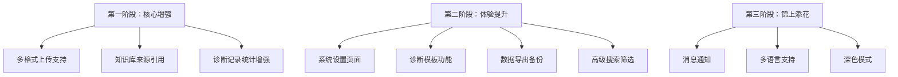

# 毕业设计功能完善建议方案

## 项目现状概述

当前系统是一个基于 **Streamlit + LangChain + RAG** 的智能临床决策支持系统，已实现以下核心功能：

| 模块 | 状态 | 说明 |
|------|------|------|
| 首页仪表盘 | ✅ 已实现 | 4 个指标卡片 + 诊断趋势折线图 + 疾病分布/知识库分布柱状图 |
| 知识库管理 | ✅ 已实现 | TXT 上传、MD5 去重、文档列表查看、删除 |
| 鉴别诊断辅助 | ✅ 已实现 | 症状输入 → RAG 检索 → LLM 生成结构化诊断建议 + PDF 导出 |
| 智能临床问答 | ✅ 已实现 | 基于 RAG 的多轮对话，支持历史记录 |
| 用药安全核查 | ✅ 已实现 | 药物名称检索 → 结构化安全信息展示 |
| 患者诊断记录 | ✅ 已实现 | 增删改查 + 同步到知识库 |
| 操作日志 | ✅ 已实现 | 全操作审计日志 + 分页查询 + 类型筛选 |
| 用户认证 | ✅ 已实现 | 工号+密码注册/登录，SHA-256 加密 |
| PDF 报告导出 | ✅ 已实现 | reportlab 生成结构化 A4 诊断报告 |

---

## 建议完善的功能（按优先级排序）

### 一、高优先级（核心功能增强）

#### 1. 知识库批量上传与多格式支持

**现状**：仅支持单文件 TXT 上传。

**建议改进**：
- 支持 **PDF、Word（.docx）、Markdown（.md）** 格式上传
- 支持 **批量上传**（多文件同时上传）
- 上传时显示进度条（当前已上传 / 总数）

**技术方案**：
```python
# 新增依赖：python-docx, PyPDF2, python-magic
# 在 knowledge_base.py 中新增 upload_by_file 方法
def upload_by_file(self, file_bytes: bytes, filename: str, file_type: str):
    if file_type == "pdf":
        text = extract_text_from_pdf(file_bytes)
    elif file_type == "docx":
        text = extract_text_from_docx(file_bytes)
    else:  # txt / md
        text = file_bytes.decode("utf-8")
    return self.upload_by_str(text, filename)
```

**涉及文件**：[`knowledge_base.py`](RagProject/knowledge_base.py)、[`app_qa.py`](RagProject/app_qa.py)

---

#### 2. 诊断记录统计图表增强

**现状**：首页仪表盘已有基础统计，但诊断记录页面本身缺乏数据可视化。

**建议改进**：
- 在「患者诊断记录」页面顶部添加 **统计概览区域**：
  - 本月诊断数、本周诊断数、今日诊断数
  - 按诊断人统计的柱状图
  - 按疾病分类的饼图
- 支持按 **日期范围筛选** 记录

**涉及文件**：[`app_qa.py`](RagProject/app_qa.py)、[`dashboard_data.py`](RagProject/dashboard_data.py)

---

#### 3. 智能问答增加知识库来源引用

**现状**：智能临床问答仅显示 LLM 生成的回答，不展示检索到的知识库来源。

**建议改进**：
- 在每条回答下方以折叠面板展示 **参考文档来源**
- 显示来源文件名、片段内容、相似度分数
- 增加"可信度"指示（基于检索结果的相关性）

**技术方案**：修改 [`rag.py`](RagProject/rag.py) 中的 `__get_chain` 方法，在返回结果的同时返回检索到的文档列表。

**涉及文件**：[`rag.py`](RagProject/rag.py)、[`app_qa.py`](RagProject/app_qa.py)

---

### 二、中优先级（用户体验提升）

#### 4. 系统设置页面

**现状**：配置参数硬编码在 [`config_data.py`](RagProject/config_data.py) 中。

**建议改进**：
- 新增「系统设置」页面，允许管理员在 UI 中修改：
  - 检索参数：`similarity_threshold`（检索数量）、`chunk_size`（分块大小）
  - 检索策略：`similarity` / `mmr`
  - LLM 模型选择：`qwen3-max` / `qwen3-plus` / `qwen-turbo`
- 设置保存到 JSON 配置文件，重启后生效

**涉及文件**：[`app_qa.py`](RagProject/app_qa.py)、[`config_data.py`](RagProject/config_data.py)

---

#### 5. 诊断记录模板功能

**现状**：每次新增诊断记录需手动填写所有字段。

**建议改进**：
- 支持 **保存为模板**：将常用诊断记录保存为模板
- 新增时选择模板，自动填充常见字段
- 适合基层医生的常见病模板（如上呼吸道感染、高血压、糖尿病等）

**涉及文件**：[`diagnosis_records.py`](RagProject/diagnosis_records.py)、[`app_qa.py`](RagProject/app_qa.py)

---

#### 6. 数据导出与备份

**现状**：仅支持单条诊断报告的 PDF 导出。

**建议改进**：
- **批量导出**：选择多条诊断记录，一键导出为 ZIP（内含多个 PDF）
- **数据备份**：一键导出所有数据（诊断记录、用户信息、操作日志）为 JSON 压缩包
- **数据导入**：支持从备份文件恢复数据

**涉及文件**：[`app_qa.py`](RagProject/app_qa.py)、[`report_generator.py`](RagProject/report_generator.py)

---

#### 7. 搜索与筛选增强

**现状**：诊断记录仅支持关键词搜索。

**建议改进**：
- 增加 **高级筛选** 功能：
  - 按日期范围筛选
  - 按诊断人筛选
  - 按疾病类型筛选
  - 多条件组合筛选
- 搜索结果 **高亮显示** 匹配关键词

**涉及文件**：[`diagnosis_records.py`](RagProject/diagnosis_records.py)、[`app_qa.py`](RagProject/app_qa.py)

---

### 三、低优先级（锦上添花）

#### 8. 消息通知系统

**现状**：无主动通知机制。

**建议改进**：
- 在侧边栏顶部添加 **通知铃铛图标**
- 通知类型：
  - 知识库上传完成通知
  - 诊断记录同步到知识库成功通知
  - 系统更新提示
- 使用 `st.session_state` 存储未读通知列表

**涉及文件**：[`app_qa.py`](RagProject/app_qa.py)

---

#### 9. 多语言支持

**现状**：仅支持中文界面。

**建议改进**：
- 在侧边栏底部添加语言切换按钮（中文 / English）
- 使用字典映射管理多语言文本
- 适合毕业设计展示国际化能力

**涉及文件**：[`app_qa.py`](RagProject/app_qa.py)

---

#### 10. 深色模式

**现状**：仅支持浅色主题。

**建议改进**：
- 在侧边栏添加 **深色/浅色模式切换** 开关
- 通过 CSS 变量切换主题色
- 深色模式配色参考 vue-element-admin 的暗色主题

**涉及文件**：[`app_qa.py`](RagProject/app_qa.py)

---

## 推荐实施路线图



### 第一阶段（建议优先实现）
1. **多格式上传支持** — 提升知识库实用性，让用户能直接上传 PDF/Word 文档
2. **知识库来源引用** — 增强 LLM 回答的可信度和可追溯性
3. **诊断记录统计增强** — 让诊断记录页面本身具备数据分析能力

### 第二阶段
4. **系统设置页面** — 让配置可动态调整，无需修改代码
5. **诊断模板功能** — 提高基层医生的工作效率
6. **数据导出备份** — 保障数据安全，方便迁移

### 第三阶段
7. **消息通知**、**多语言**、**深色模式** — 提升用户体验和毕业设计展示效果

---

## 技术可行性评估

| 功能 | 难度 | 预计代码量 | 关键依赖 |
|------|------|-----------|---------|
| 多格式上传 | ⭐⭐ | ~150 行 | python-docx, PyPDF2 |
| 来源引用 | ⭐⭐⭐ | ~200 行 | 修改 RAG 链返回值 |
| 统计增强 | ⭐ | ~100 行 | 已有 dashboard_data.py |
| 系统设置 | ⭐⭐ | ~200 行 | JSON 配置文件 |
| 诊断模板 | ⭐⭐ | ~150 行 | 新增模板 JSON 文件 |
| 数据导出 | ⭐ | ~100 行 | zipfile 标准库 |
| 高级筛选 | ⭐⭐ | ~150 行 | 修改查询逻辑 |
| 消息通知 | ⭐ | ~80 行 | session_state |
| 多语言 | ⭐⭐ | ~200 行 | 字典映射 |
| 深色模式 | ⭐⭐⭐ | ~300 行 | CSS 变量切换 |

---

## 总结

当前项目已经具备了一个完整的临床决策支持系统的基础框架，核心功能完善。建议优先实现 **第一阶段** 的 3 个功能，这些功能能显著提升系统的实用性和用户体验，同时技术难度适中，适合毕业设计的增量开发节奏。

如需进一步讨论某个功能的实现细节，我可以提供更详细的技术方案。
